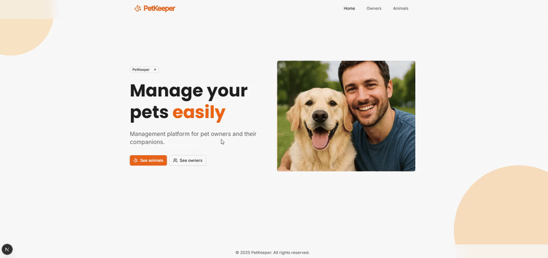

# 🐾 PetKeeper - Plateforme de Gestion d'Animaux

Application web full-stack moderne pour la gestion d'animaux de compagnie et de leurs propriétaires, construite avec **Next.js**, **NestJS**, et **GraphQL**.


## 🎥 Démonstration



## 🚀 Installation Rapide

1. **Cloner le repository**

   ```bash
   git clone <repository-url>
   cd TestTKORP
   ```

2. **Créer le fichier .env**

   ```bash
   cp .env.example .env
   # Ou créer manuellement avec les valeurs ci-dessous
   ```

   **Contenu du fichier .env :**

   ```env
   # 🗄️ MySQL Database Configuration
   MYSQL_ROOT_PASSWORD=YOUR_MYSQL_ROOT_PASSWORD
   MYSQL_DATABASE=YOUR_MYSQL_DATABASE
   MYSQL_USER=YOUR_MYSQL_USER
   MYSQL_PASSWORD=YOUR_MYSQL_PASSWORD

   # 🔌 Backend Environment Variables
   DB_HOST=YOUR_DB_HOST
   DB_PORT=YOUR_DB_PORT
   DB_USERNAME=YOUR_DB_USERNAME
   DB_PASSWORD=YOUR_DB_PASSWORD
   DB_DATABASE=YOUR_DB_DATABASE

   # 🚀 Application Ports
   BACKEND_PORT=YOUR_BACKEND_PORT
   FRONTEND_PORT=YOUR_FRONTEND_PORT
   MYSQL_PORT=YOUR_MYSQL_PORT

   # 🔧 Node Environment
   NODE_ENV=YOUR_NODE_ENV
   ```

   **Exemple de valeurs par défaut :**

   # 🔧 Node Environment

   NODE_ENV=development

   ```

   ```

3. **Lancer l'application**

   ```bash
   docker-compose up -d
   ```

4. **Accéder aux applications**
   - Frontend: http://localhost:3000
   - Backend GraphQL: http://localhost:4000/graphql

## 🎯 Fonctionnalités

### 🎯 Fonctionnalités Principales

- **Gestion d'Animaux** : CRUD complet pour les profils d'animaux
- **Gestion de Propriétaires** : Gestion des informations et contacts des propriétaires
- **Relations** : Liaison entre animaux et propriétaires avec gestion complète des relations
- **Recherche & Filtrage Avancés** : Trouvez rapidement animaux et propriétaires
- **Design Responsive** : Interface magnifique qui fonctionne sur tous les appareils

### 📊 Analytics & Statistiques

- **Animal le plus âgé** : Recherche dans toute la base de données
- **Espèce la plus commune** : Découvrez les espèces d'animaux les plus populaires
- **Propriétaire avec le plus d'animaux** : Identifiez les propriétaires avec le plus grand nombre d'animaux
- **Analytics de poids** : Suivi des statistiques de poids et animaux les plus lourds
- **Statistiques spécialisées** : Analytics spécialisées pour les propriétaires de chats

### 🔧 Fonctionnalités Techniques

- **API GraphQL** : Récupération de données moderne et efficace
- **Pagination** : Gestion efficace des grands datasets
- **Type Safety** : Implémentation TypeScript complète
- **Gestion d'erreurs** : Système de gestion d'erreurs complet
- **Support Docker** : Déploiement containerisé
- **Composants UI Modernes** : Construits avec Tailwind CSS et shadcn/ui

## 🏗️ Architecture

### Frontend (Next.js 15)

```
test-frontend/
├── src/
│   ├── app/                    # Pages App Router
│   │   ├── animals/           # Pages de gestion des animaux
│   │   ├── owners/            # Pages de gestion des propriétaires
│   │   └── globals.css        # Styles globaux
│   ├── components/            # Composants UI réutilisables
│   │   ├── ui/               # Composants shadcn/ui
│   │   ├── common/           # Composants communs
│   │   └── layout/           # Composants de layout
│   ├── features/             # Composants spécifiques aux fonctionnalités
│   │   ├── animals/          # Composants liés aux animaux
│   │   ├── owners/           # Composants liés aux propriétaires
│   │   └── home/             # Composants de la page d'accueil
│   ├── graphql/              # Requêtes GraphQL
│   ├── hooks/                # Hooks React personnalisés
│   ├── lib/                  # Fonctions utilitaires
│   └── types/                # Définitions TypeScript
```

### Backend (NestJS)

```
test-backend/
├── src/
│   ├── modules/              # Modules fonctionnels
│   │   ├── animals/          # Gestion des animaux
│   │   └── owners/           # Gestion des propriétaires
│   ├── common/               # Utilitaires partagés
│   │   ├── components/       # Composants partagés
│   │   ├── exceptions/       # Gestion d'erreurs
│   │   ├── filters/          # Filtres d'exceptions
│   │   ├── graphql/          # Schémas GraphQL
│   │   └── services/         # Services partagés
│   └── main.ts               # Point d'entrée de l'application
```

## 🛠️ Stack Technique

### Frontend

- **Framework** : Next.js 15 (App Router)
- **Langage** : TypeScript
- **Styles** : Tailwind CSS
- **Composants UI** : shadcn/ui avec thème orange personnalisé
- **Client GraphQL** : Apollo Client
- **Icônes** : Lucide React
- **Gestion des dates** : date-fns
- **Polices** : Famille Geist

### Backend

- **Framework** : NestJS (11.x)
- **Langage** : TypeScript (5.x)
- **Base de données** : MySQL (8.x) avec TypeORM
- **API** : GraphQL avec Apollo Server
- **Validation** : class-validator & class-transformer
- **Documentation** : Schéma GraphQL auto-généré

### DevOps & Outils

- **Containerisation** : Docker & Docker Compose
- **Gestionnaire de packages** : npm

## 🎨 Système de Design

### Thème Orange Personnalisé

- **Couleur Principale** : Orange (#f97316)
- **Générateur utilisé** : [ui.jln.dev](https://ui.jln.dev/) pour les couleurs shadcn/ui
- **Typographie** : Famille de polices Geist
- **Design** : Moderne, épuré, responsive

### Couleurs du Thème

- **Primary** : `hsl(22.93, 92.59%, 52.35%)` - Orange principal
- **Secondary** : `hsl(34.05, 100%, 85.49%)` - Orange clair
- **Destructive** : `hsl(10.16, 77.87%, 53.92%)` - Rouge d'erreur
- **Ring** : `hsl(24.8, 79.79%, 63.14%)` - Focus ring

## 📊 API GraphQL

### Requêtes Principales

```graphql
# Récupérer tous les animaux avec pagination
query GetAnimals($page: Int, $limit: Int) {
  animals(page: $page, limit: $limit) {
    items {
      id
      name
      species
      breed
      color
      weight
      dateOfBirth
      owner {
        id
        firstName
        lastName
      }
    }
    meta {
      totalItems
      totalPages
      currentPage
      itemsPerPage
    }
  }
}

# Récupérer tous les propriétaires avec leurs animaux
query GetOwners($page: Int, $limit: Int) {
  owners(page: $page, limit: $limit) {
    items {
      id
      firstName
      lastName
      email
      phoneNumber
      animals {
        id
        name
        species
      }
    }
    meta {
      totalItems
      totalPages
      currentPage
    }
  }
}
```

### Requêtes de Statistiques

---

#### 🐰 **Animal le plus âgé**

**📝 Requête GraphQL :**

```graphql
query GetOldestAnimal {
  oldestAnimal {
    id
    name
    species
    dateOfBirth
    owner {
      firstName
      lastName
    }
  }
}
```

**📊 Résultat :**

```json
{
  "data": {
    "oldestAnimal": {
      "id": 934,
      "name": "Rocky",
      "species": "Rabbit",
      "dateOfBirth": "2009-09-21",
      "owner": {
        "firstName": "Emma",
        "lastName": "Johnson"
      }
    }
  }
}
```

---

#### 🐦 **Espèce la plus commune**

**📝 Requête GraphQL :**

```graphql
query GetMostCommonSpecies {
  mostCommonSpecies {
    species
    count
  }
}
```

**📊 Résultat :**

```json
{
  "data": {
    "mostCommonSpecies": {
      "species": "Bird",
      "count": 179
    }
  }
}
```

---

#### 👥 **Propriétaire avec le plus d'animaux**

**📝 Requête GraphQL :**

```graphql
query GetOwnerWithMostAnimals {
  ownerWithMostAnimals {
    owner {
      id
      firstName
      lastName
    }
    animalCount
  }
}
```

**📊 Résultat :**

```json
{
  "data": {
    "ownerWithMostAnimals": {
      "owner": {
        "id": 18,
        "firstName": "Sophia",
        "lastName": "Brown"
      },
      "animalCount": 6
    }
  }
}
```

---

#### 🐱 **Propriétaire avec le plus de chats**

**📝 Requête GraphQL :**

```graphql
query GetOwnerWithMostCats {
  ownerWithMostCats {
    owner {
      id
      firstName
      lastName
    }
    catCount
  }
}
```

**📊 Résultat :**

```json
{
  "data": {
    "ownerWithMostCats": {
      "owner": {
        "id": 268,
        "firstName": "Sarah",
        "lastName": "White"
      },
      "catCount": 4
    }
  }
}
```

---

#### ⚖️ **Propriétaire avec l'animal le plus lourd**

**📝 Requête GraphQL :**

```graphql
query GetOwnerWithHeaviestAnimal {
  ownerWithHeaviestAnimal {
    owner {
      id
      firstName
      lastName
    }
    animal {
      id
      name
      weight
      species
    }
  }
}
```

**📊 Résultat :**

```json
{
  "data": {
    "ownerWithHeaviestAnimal": {
      "owner": {
        "id": 209,
        "firstName": "Emma",
        "lastName": "Smith"
      },
      "animal": {
        "id": 821,
        "name": "Chloe",
        "weight": 49937,
        "species": "Dog"
      }
    }
  }
}
```

---

#### 📊 **Propriétaire avec le groupe d'animaux le plus lourd**

**📝 Requête GraphQL :**

```graphql
query GetOwnerWithHeaviestAnimalsGroup {
  ownerWithHeaviestAnimalsGroup {
    owner {
      id
      firstName
      lastName
    }
    totalWeight
  }
}
```

**📊 Résultat :**

```json
{
  "data": {
    "ownerWithHeaviestAnimalsGroup": {
      "owner": {
        "id": 18,
        "firstName": "Sophia",
        "lastName": "Brown"
      },
      "totalWeight": 172152
    }
  }
}
```

### Mutations

```graphql
# Créer un nouvel animal
mutation CreateAnimal($input: CreateAnimalInput!) {
  createAnimal(input: $input) {
    id
    name
    species
    breed
    color
    weight
    dateOfBirth
  }
}

# Créer un nouveau propriétaire
mutation CreateOwner($input: CreateOwnerInput!) {
  createOwner(input: $input) {
    id
    firstName
    lastName
    email
    phoneNumber
  }
}

# Mettre à jour un animal
mutation UpdateAnimal($id: Int!, $input: UpdateAnimalInput!) {
  updateAnimal(id: $id, input: $input) {
    id
    name
    species
    breed
    color
    weight
  }
}
```

## 🎯 Composants UI & UX

### Composants Principaux

#### 🐾 Gestion d'Animaux

- **AnimalCard** : Cartes d'animaux avec avatars générés dynamiquement
- **AnimalDetailHeader** : En-têtes des pages de détail d'animaux
- **AnimalDetailInfoCard** : Cartes d'information (couleur, poids, etc.)
- **AnimalOwnerInfoCard** : Informations du propriétaire associé

#### 👥 Gestion de Propriétaires

- **OwnerCard** : Cartes de propriétaires avec nombre d'animaux
- **OwnerDetailHeader** : En-têtes des pages de détail de propriétaires
- **OwnerAnimalsSection** : Section listant les animaux du propriétaire

#### 🏠 Layout & Navigation

- **Header** : Navigation responsive avec logo et menu hamburger
- **Footer** : Pied de page avec informations de copyright
- **CircleBackground** : Fond décoratif avec cercles animés
- **BackButton** : Bouton de retour avec navigation contextuelle

#### ⚡ États & Interactions

- **Loading States** : Composants skeleton pour le chargement
- **Error Handling** : Pages 404 personnalisées par section
- **Pagination** : Navigation efficace avec métadonnées
- **Hover Effects** : Animations et transitions fluides

### Design System

- **Mobile First** : Approche responsive mobile d'abord
- **Consistent Spacing** : Échelle de spacing Tailwind cohérente
- **Type Safety** : Tous les composants typés strictement
- **Accessibility** : Composants accessibles avec Radix UI

## 🔍 Fonctionnalités Avancées

### Gestion d'Animaux

- Opérations CRUD complètes pour les animaux
- Génération d'avatars dynamiques basée sur l'ID de l'animal
- Profils détaillés d'animaux avec informations du propriétaire
- Suivi des espèces et races
- Gestion du poids et de l'âge

### Gestion de Propriétaires

- Gestion complète des profils de propriétaires
- Suivi des informations de contact
- Relations avec plusieurs animaux
- Analytics spécifiques aux propriétaires

### Analytics Dashboard

- Calcul de statistiques en temps réel
- Requêtes de base de données avancées pour les insights
- Analytics basées sur le poids
- Analyse de distribution des espèces

### Configuration Apollo Client

```typescript
// src/config/ApolloProvider.tsx
const client = new ApolloClient({
  uri: "http://localhost:4000/graphql",
  cache: new InMemoryCache(),
});

// Provider wrapper pour l'application
export function ApolloProvider({ children }: { children: React.ReactNode }) {
  return <ApolloProvider client={client}>{children}</ApolloProvider>;
}
```

## 🔧 Configuration

### Variables d'Environnement Backend

```env
# Base de données MySQL
DATABASE_TYPE=mysql
DATABASE_HOST=localhost
DATABASE_PORT=3306
DATABASE_USERNAME=root
DATABASE_PASSWORD=your_password
DATABASE_NAME=petkeeper

# GraphQL
GRAPHQL_PLAYGROUND=true
GRAPHQL_DEBUG=true

# Application
PORT=4000
NODE_ENV=development
```

### Fichiers de Configuration

#### Backend

- `nest-cli.json` - Configuration NestJS CLI
- `tsconfig.json` - Configuration TypeScript stricte
- `eslint.config.mjs` - Règles ESLint

#### Frontend

- `next.config.ts` - Configuration Next.js et optimisations
- `tailwind.config.ts` - Thème personnalisé et classes utilitaires
- `components.json` - Configuration shadcn/ui et chemins
- `tsconfig.json` - Configuration TypeScript stricte

### Backend

```bash
cd test-backend

# Tests unitaires
npm run test

# Tests end-to-end
npm run test:e2e

# Couverture de code
npm run test:cov
```

### Frontend

```bash
cd test-frontend

# Linting
npm run lint

# Vérification des types
npm run type-check
```

## 🐛 Dépannage

### Problèmes Courants

1. **Connexion GraphQL échouée**

   ```bash
   # Vérifier que le backend est démarré
   cd test-backend && npm run start:dev
   # Vérifier l'URL: http://localhost:4000/graphql
   ```

2. **Connexion MySQL échouée**

   ```bash
   # Vérifier que MySQL est démarré
   sudo service mysql start
   # Vérifier les credentials dans les variables d'environnement
   ```

3. **Erreurs de Build TypeScript**

   ```bash
   # Vérifier les types
   npm run type-check
   # Nettoyer le cache Next.js
   rm -rf .next && npm run dev
   ```

4. **Port déjà utilisé**
   ```bash
   # Backend: changer le port
   PORT=4001 npm run start:dev
   # Frontend: utiliser un autre port
   npm run dev -- -p 3001
   ```

### Mode Debug

```bash
# Backend avec logs détaillés
DEBUG=* npm run start:dev

# Frontend avec debug Apollo
APOLLO_CLIENT_DEBUG=true npm run dev
```

## 📦 Commandes Utiles

### Développement

```bash
# Backend
cd test-backend
npm run start:dev          # Mode watch avec rechargement automatique
npm run start:debug        # Mode debug avec inspection

# Frontend
cd test-frontend
npm run dev                # Serveur de développement
npm run build              # Build de production
```

### Qualité de Code

```bash
# Backend
npm run lint               # Linting avec correction automatique
npm run format             # Formatage avec Prettier

# Frontend
npm run lint               # ESLint
npm run type-check         # Vérification TypeScript
```

## 🤝 Contribution

1. **Fork** le repository
2. **Créer** une branche feature (`git checkout -b feature/amazing-feature`)
3. **Commiter** les changements (`git commit -m 'Add amazing feature'`)
4. **Push** sur la branche (`git push origin feature/amazing-feature`)
5. **Ouvrir** une Pull Request

### Standards de Code

- **TypeScript First** : Tous les composants typés strictement
- **Conventions NestJS** : Suivre les bonnes pratiques NestJS
- **App Router** : Utiliser les conventions Next.js 13+
- **Tests** : Ajouter des tests pour les nouvelles fonctionnalités
- **Documentation** : Documenter les APIs GraphQL

## 🎨 Design & Inspiration

- **Moodboard Figma** : [Lien vers le moodboard](https://www.figma.com/design/zZoXLW3Qa6d0HwfQtlY9nS/PetKEEPER?node-id=0-1&t=DuPl06BAUK0FaZjx-1)
- **Générateur de thème** : [ui.jln.dev](https://ui.jln.dev/) pour les couleurs shadcn/ui
- **Design System** : Thème orange cohérent avec composants réutilisables

## 📝 License

Ce projet est sous licence MIT. Voir le fichier [LICENSE](LICENSE) pour plus de détails.

## 🙏 Remerciements

- **Next.js Team** - Framework React extraordinaire
- **NestJS Team** - Framework Node.js puissant
- **shadcn/ui** - Composants UI magnifiques
- **Tailwind CSS** - Framework CSS utility-first
- **Apollo GraphQL** - Implémentation GraphQL excellente
- **TypeORM** - ORM TypeScript robuste
